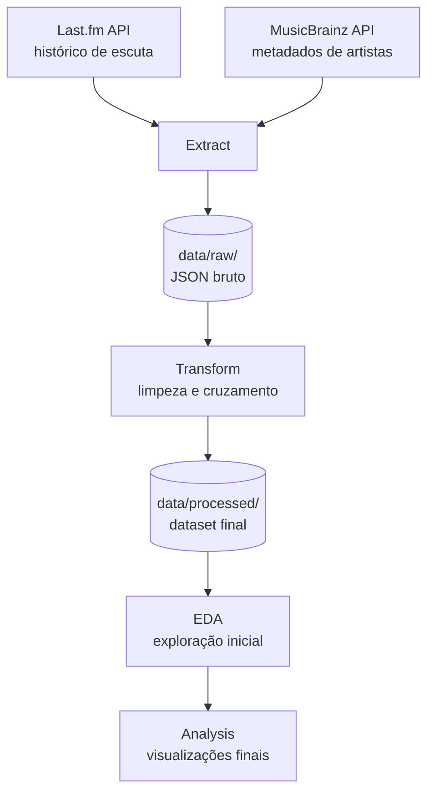

# music-data-analysis
projeto de análise dos meus dados musicais via API do last.fm + musicBrainz

## fluxograma do projeto

```mermaid
flowchart TD
    A[Last.fm API<br/>histórico de escuta] --> C[Extract]
    B[MusicBrainz API<br/>metadados de artistas] --> C[Extract]
    C --> D[(data/raw/<br/>JSON bruto)]
    D --> E[Transform<br/>limpeza e cruzamento]
    E --> F[(data/processed/<br/>dataset final)]
    F --> G[EDA<br/>exploração inicial]
    G --> H[Analysis<br/>visualizações finais]
```
